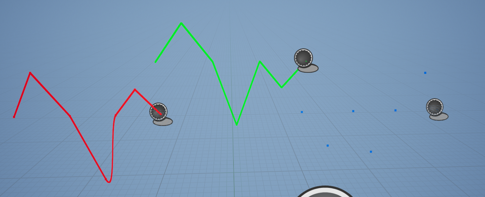
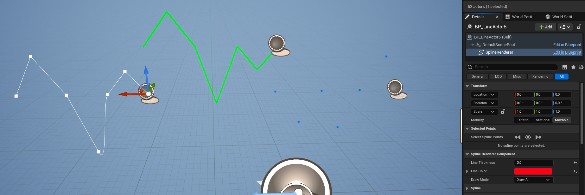
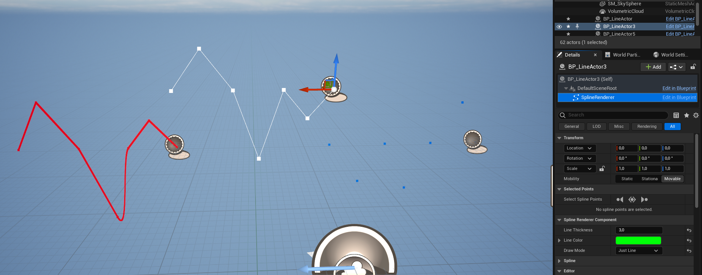
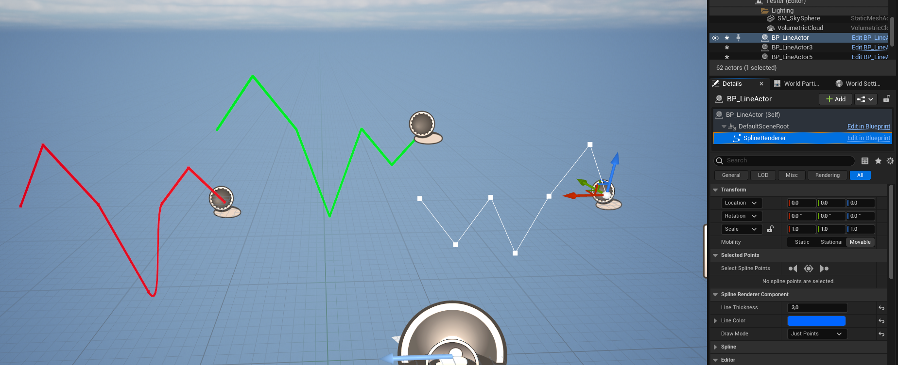

# Spline Renderer Component

 

  

  <h3 align="center">Spline Renderer Component</h3>

  

    Draw spline line and render it in editor and runtime.
     
     
  

Spline Renderer Component allows to simply draw a line which works in editor and at runtime. It's child class of Spline Component so it inherits all its functionality.

# How to use

Follow these steps:

1) Add Spline Renderer Component to an Actor blueprint:

2) Set Thickness and Line Color under Spline Renderer Component:

3) You can change drawing mode to Draw All:

4) Drawing mode to Just Line:

5) Drawing mode to Just Points:

6) Enjoy :)

Tested under Unreal 5.x
